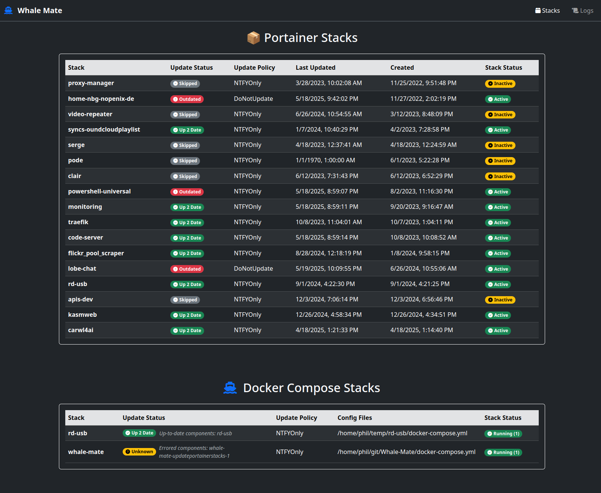

[](https://github.com/NopeNix/whale-mate/actions/workflows/Build%20and%20Push%20to%20Docker%20Hub.yml)


# Whale Mate - Automated Portainer & Docker Compose Stack Updater



## Introduction

Whale Mate is an automated solution for managing and updating your Portainer stacks and Docker Compose files. It provides:

- Automatic updates for your containers based on different policies
- Visual dashboard showing current stack status
- NTFY notification integration
- Scheduled updates via CRON
- Full update logs

## Features

- **Portainer Stack Management**: Check and update all your Portainer stacks
- **Docker Compose Support**: Also manages standalone docker-compose.yml files
- **Flexible Update Policies**:
  - `AutoUpdate`: Automatically update the stack
  - `NTFYOnly`: Only send notification about available updates
  - `DoNotUpdate`: Never update this stack
- **Web Dashboard**: Beautiful dark-mode UI to monitor all stacks
- **CRON Scheduling**: Runs updates on your schedule
- **NTFY Integration**: Get notified about updates

## Prerequisites

Before using Whale Mate, you'll need:

1. Docker and Docker Compose installed
2. A running Portainer instance (for Portainer stack management, optional)
3. (Optional) An NTFY server if you want notifications

## Installation

1. Create a `docker-compose.yml` file with the following content:

```yaml
version: '3'
services:
  updateportainerstacks:
    image: nopenix/whale-mate:latest
    ports:
      - 8080:8080 # Exposes HTTP 
    restart: unless-stopped
    volumes:
      - /var/run/docker.sock:/var/run/docker.sock # only needed for docker copmpose
      - /:/mnt/rootfs/:ro # only needed for docker compose and only if you want the update feature
      - db:/data/db
    environment:
      # Auto Update Settings
      AutoUpdateDefaultMode: AutoUpdate # Can be: NTFYOnly, AutoUpdate, DoNotUpdate
      CRON_SCHEDULE: "*/30 * * * *" # CRON String. Sets when the Programm is triggered 
      # Portainer Settings
      PortainerBaseAddress: https://portainer.yourdomain.com # just the base address of your portainer
      PortainerAPIToken: your-portainer-api-token # Portainer API Token goes here
      # NTFY Settings
      NTFYEnabled: $true # Can be $true or $false
      NTFYTopicURL: https://ntfy.yourdomain.com/Portainer-Updates
      NTFYToken: # Can also be left empty if there is none
volumes:
  db:
```

2. Customize the environment variables (Optional):
   - `PortainerBaseAddress`: Your Portainer instance URL
   - `PortainerAPIToken`: Generate this in Portainer (Settings > API)
   - Adjust `CRON_SCHEDULE` for your needs (default every 5 mins)
   - Configure NTFY settings if desired

3. Start the container:
```bash
docker-compose up -d
```

## Configuration Options

### Environment Variables

| Variable | Description | Default | Required |
|----------|-------------|---------|----------|
| `AutoUpdateDefaultMode` | Default update policy (`AutoUpdate`, `NTFYOnly`, `DoNotUpdate`) | `AutoUpdate` | No |
| `CRON_SCHEDULE` | CRON expression for update schedule | `*/5 * * * *` | No |
| `PortainerBaseAddress` | Base URL of your Portainer instance | - | No |
| `PortainerAPIToken` | API token for Portainer | - | No |
| `NTFYEnabled` | Enable/disable NTFY notifications | `$false` | No |
| `NTFYTopicURL` | NTFY topic URL | - | Only if NTFY enabled |
| `NTFYToken` | NTFY access token | - | Only if your NTFY requires auth |

### Per-Stack Configuration

You can control updating behavior for individual stacks by adding comments to your stack files:

```yaml
#UpdatePolicy=AutoUpdate  # Will automatically update this stack
#UpdatePolicy=NTFYOnly    # Only notify about updates, don't auto-update
#UpdatePolicy=DoNotUpdate # Never update this stack
```

## Usage

1. After starting the container, access the web interface at `http://your-host:8080`
2. The dashboard shows:
   - All Portainer stacks with their update status
   - All Docker Compose stacks
3. View update logs by clicking the "Logs" link in the navigation

## Update Policies

Whale Mate supports three update policies:

1. **AutoUpdate**: Automatically pull latest images and update the stack
2. **NTFYOnly**: Check for updates but only send notification (don't update)
3. **DoNotUpdate**: Skip this stack completely

The default policy can be set via `AutoUpdateDefaultMode` environment variable, and can be overridden per-stack with the `#UpdatePolicy` comment.

## Notifications

When configured with NTFY, you'll receive notifications about:
- Available updates
- Successful updates


## Troubleshooting

1. **Can't access Portainer API**:
   - Verify `PortainerBaseAddress` is correct
   - Check API token has proper permissions
   - Ensure Portainer is accessible from the Whale Mate container

2. **Stacks not appearing**:
   - For Portainer stacks, ensure they're not Swarm stacks (only Standalone stacks supported)
   - For Docker Compose, ensure files have proper permissions

3. **Check logs**:
```bash
docker-compose logs -f
```

## FAQ

**Q: How often does it check for updates?**  
A: By default every 5 minutes (configurable via CRON_SCHEDULE)

**Q: Can I exclude specific stacks?**  
A: Yes, add `#UpdatePolicy=DoNotUpdate` to your stack file

**Q: Does it work with Swarm mode?**  
A: Currently only supports standalone Docker stacks (non-Swarm) Portainer is supported in Swarm mode

## Contributing

Contributions are welcome! Please open issues or PRs on GitHub.

## License

MIT
